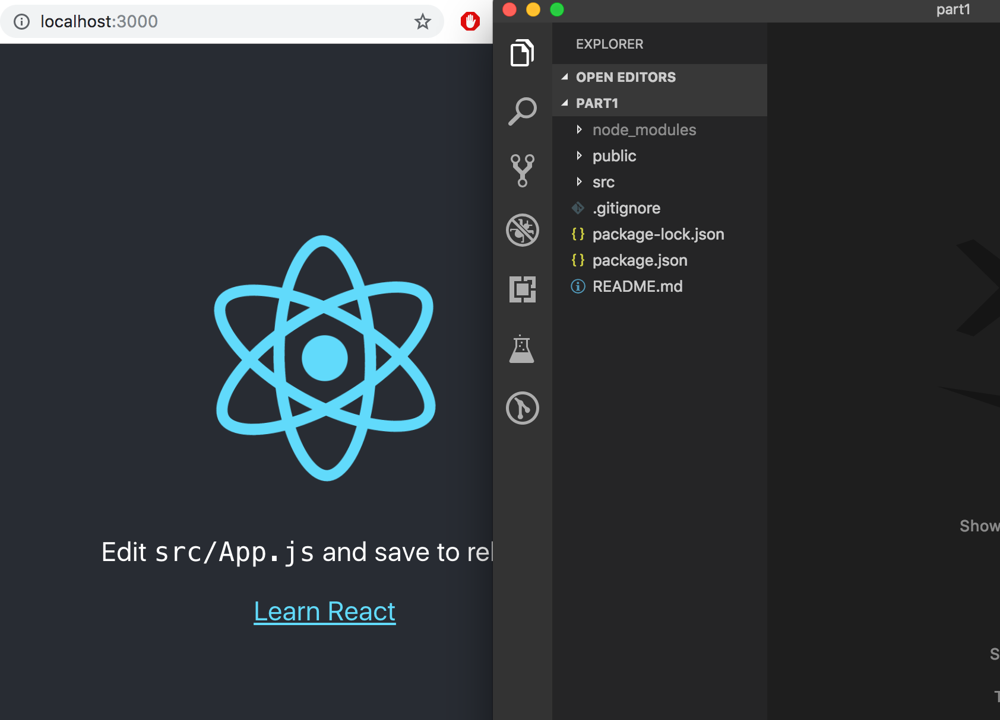

<div class="content">

[Питон](https://www.python.org/) - это интерпретатор. Специальная программа, которая интерпретирует и выполняет по шагам другие программы. Определяет набор правил, согласно которому составляются программы. Также определяет набор правил по которым эти программы выполняются на компьютере.
 

**Программа** - это последовательность команд для компьютера, который написан согласно правилам Питона.  Более менее все программы выглядят следующим образом:  читает некие пользовательские данные, манипулирует данные, вычисляет и выводит результат.

**Текстовый редактор** - блокнот или в другом редакторе. Но лучше писать в среде, где будет подстветка синтаксиса, выделение ключевых каких-то слов языка и видеть результаты. В интерактивном режиме. Пример: PyCharm, Visual Studio Code, Python IDLE


```bash
C:\Users\Your Name>python
Python 3.6.4 (v3.6.4:d48eceb, Dec 19 2017, 06:04:45) [MSC v.1900 32 bit (Intel)] on win32
Type "help", "copyright", "credits" or "license" for more information.
>>> print("Привет, Мир") 
```

Вы можете использовать любую известную вам среду разработки <em>(IDE)</em>, но при одном условии - вы будете использовать интерпретатор **Python3.6+**.
Сам python можете загрузить в  https://www.python.org/downloads/ .
Можно работать в консоле, IDE, онлайн-интерпретаторах, в блокноте. Код на python кроссплатформенный, что означает: "написал один раз, работает везде".


```bash
C:\Users\Your Name>python
Python 3.6.4 (v3.6.4:d48eceb, Dec 19 2017, 06:04:45) [MSC v.1900 32 bit (Intel)] on win32
Type "help", "copyright", "credits" or "license" for more information.
>>> print("Привет, Мир!")
Привет, Мир! 
```


### Полезные инструменты

- [Пошаговый визуализатор выполнения вашей программы](http://www.pythontutor.com/visualize.html#mode=edit)

- [PyCharm (Community версия)](https://www.jetbrains.com/pycharm/download/) - довольно распространённая IDE

В качестве альтернативных онлайн интерпретаторов можно воспользоваться следующими ресурсами:

- https://repl.it/languages/python3 - удобный интерпретатор

- www.pythontutor.com/visualize.html - выбрать Python3.6 - также поможет визуализировать поток выполнения программы.

- https://www.python.org/shell/ - python консоль

- http://pythonfiddle.com/

- https://ideone.com/

- Текстовый редактор с подсветкой синтаксиса программ [Sublime Text 3](http://www.sublimetext.com/3)




### Документация Python 3

Официальная документация по Python: https://docs.python.org/3/

Интерактивный учебник языка Python (на русском языке): http://pythontutor.ru/

Книга A Byte of Python: http://www.swaroopch.com/notes/python/

Книга A Byte of Python перевод на русский: http://wombat.org.ua/AByteOfPython/

EN documentation: https://docs.python.org/3/tutorial/index.html

Документация на RU : http://catbo.net/c/translated/Python-enru/Python.zip/tutorial/index.html

### PEP8 - стиль в коде

PEP8 - это руководство по написанию кода на Python.

На английском - EN : https://www.python.org/dev/peps/pep-0008/

На русском - RU : https://pythonworld.ru/osnovy/pep-8-rukovodstvo-po-napisaniyu-koda-na-python.html


  <h3>Exercises 1.1.-1.2.</h3>

Exercises are submitted through GitHub and by marking completed exercises in the [submission application](https://studies.cs.helsinki.fi/stats/courses/fullstackopen).

You may submit all the exercises of this course into the same repository, or use multiple repositories. If you submit exercises of different parts into the same repository, please use a sensible naming scheme for the directories.

One very functional file  structure for the submission repository is as follows:

```
part0
part1
  courseinfo
  unicafe
  anecdotes
part2
  phonebook
  countries
```

See [this](https://github.com/fullstack-hy2020/example-submission-repository)!

For each part of the course there is a directory, which further branches into directories containing a series of exercises, like "unicafe" for part 1.

For each web application for a series of exercises, it is recommended to submit all files relating to that application, except for the directory <i>node\_modules</i>.

The exercises are submitted **one part at a time**. When you have submitted the exercises for a part of the course you can no longer submit undone exercises for the same part.

Note that in this part, there are more exercises besides those found below. <i>Do not submit your work</i> until you have completed all of the exercises you want to submit for the part.
  
  <h4>1.1: course information, step1</h4>

<i>The application that we will start working on in this exercise will be further developed in a few of the following exercises. In this and other upcoming exercise sets in this course, it is enough to only submit the final state of the application. If desired, you may also create a commit for each exercise of the series, but this is entirely optional.</i>

Use create-react-app to initialize a new application. Modify <i>index.js</i> to match the following

```js
import React from 'react'
import ReactDOM from 'react-dom'

const App = () => {
  const course = 'Half Stack application development'
  const part1 = 'Fundamentals of React'
  const exercises1 = 10
  const part2 = 'Using props to pass data'
  const exercises2 = 7
  const part3 = 'State of a component'
  const exercises3 = 14

  return (
    <div>
      <h1>{course}</h1>
      <p>
        {part1} {exercises1}
      </p>
      <p>
        {part2} {exercises2}
      </p>
      <p>
        {part3} {exercises3}
      </p>
      <p>Number of exercises {exercises1 + exercises2 + exercises3}</p>
    </div>
  )
}

ReactDOM.render(<App />, document.getElementById('root'))
```

and remove extra files (App.js, App.css, App.test.js, logo.svg, setupTests.js, reportWebVitals.js).

Unfortunately, the entire application is in the same component. Refactor the code so that it consists of three new components: <i>Header</i>, <i>Content</i>, and <i>Total</i>. All data still resides in the <i>App</i> component, which passes the necessary data to each component using <i>props</i>. <i>Header</i> takes care of rendering the name of the course, <i>Content</i> renders the parts and their number of exercises and <i>Total</i> renders the total number of exercises.

The <i>App</i> component's body will approximately be as follows:

```js
const App = () => {
  // const-definitions

  return (
    <div>
      <Header course={course} />
      <Content ... />
      <Total ... />
    </div>
  )
}
```

**WARNING** create-react-app automatically makes the project a git repository unless the application is created within an already existing repository. Most likely you **do not want** the project to become a repository, so run the command _rm -rf .git_ in the root of the project.

<h4>1.2: course information, step2</h4>

Refactor the <i>Content</i> component so that it does not render any names of parts or their number of exercises by itself. Instead it only renders three <i>Part</i> components of which each renders the name and number of exercises of one part.

```js
const Content = ... {
  return (
    <div>
      <Part .../>
      <Part .../>
      <Part .../>
    </div>
  )
}
```

Our application passes on information in quite a primitive way at the moment, since it is based on individual variables. This situation will improve soon.

</div>
